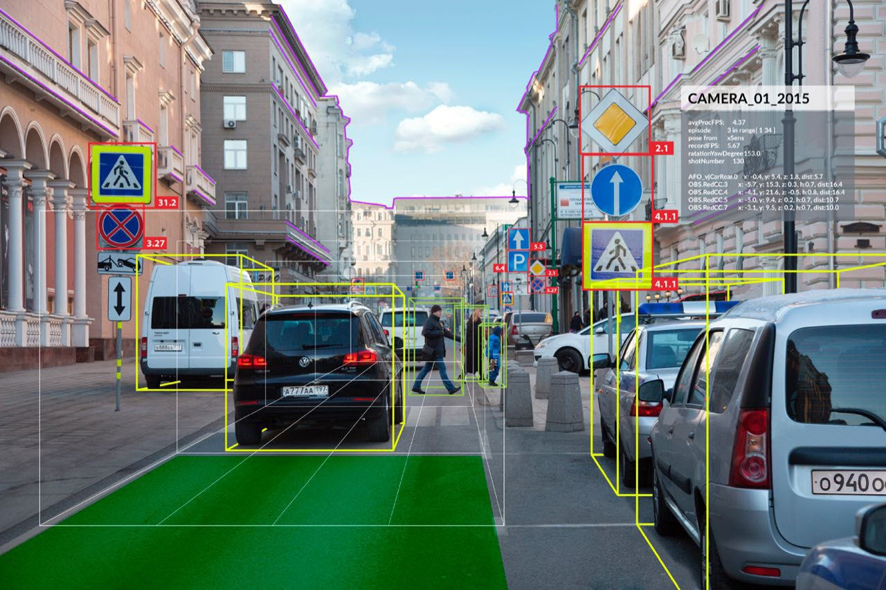
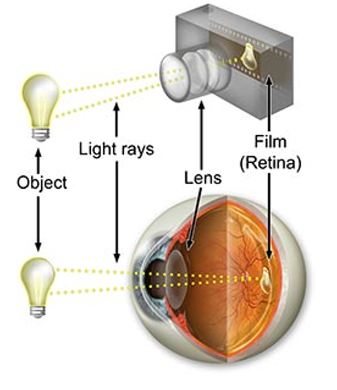
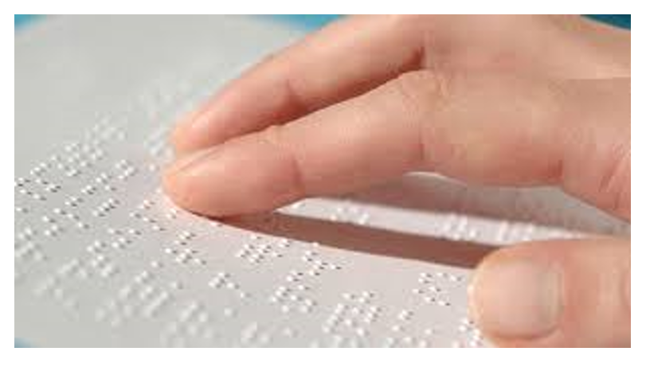
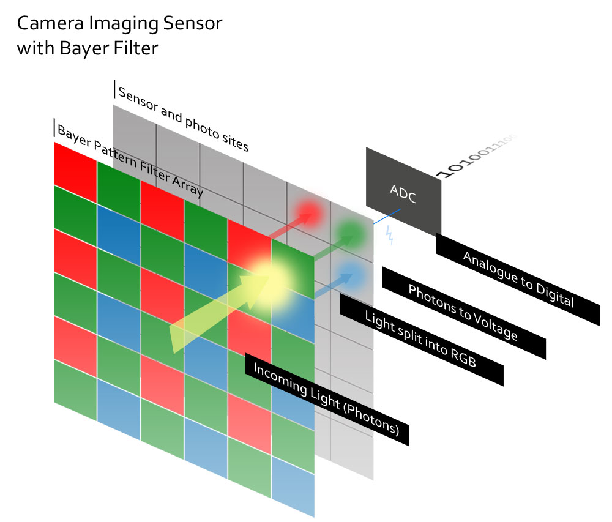
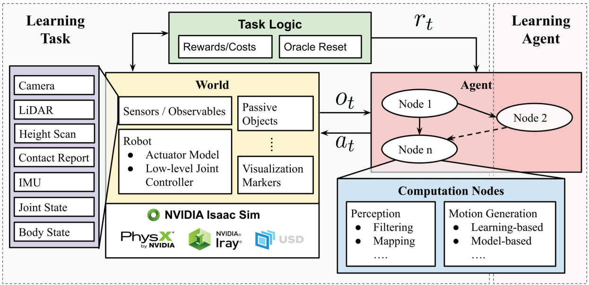
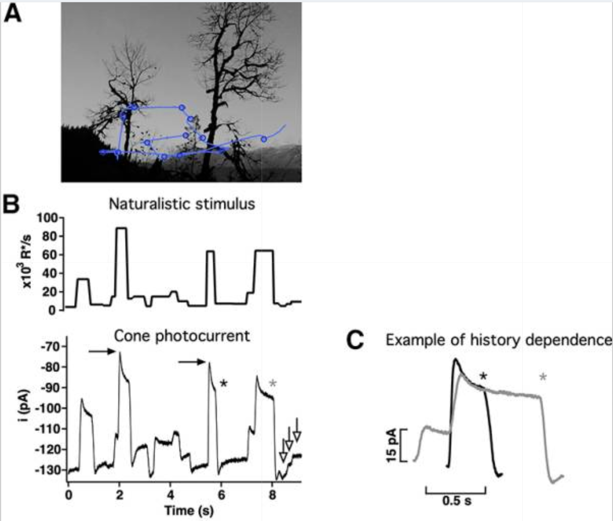

# Large-scale 3D Synthetic Scene Generation for Active Vision Modeling
## Thelonious Cooper
### Advised by Dr. Jacob Yates and Dr. Jorge Otero Milan
### Supervised by Dr. Hadi Vafaii

---
# Outline:
### - The goals of computer vision
### - The differences between human and computer vision
### - How my project contributes to bridging the gap
### - Future Work

---
# Why teach a computer how to see?
Surrogate modeling of the study of the human condition.
Applications to robotics for medicine, defence, etc.

---

# What is Sight?
## The Camera Analogy

## The Fingertip analogy

---
# How Do Computers See?

Cameras take snapshots, with no control over their direction

---
# Computer Vision
How do we teach computers?

---
# Closing the loop
## Software Architecture

---
# Closed Loop Ground-Truth Generation with Rigid-Body Physics
### We generate ground truth for estimation of 
### - Motion
### - Depth
### - Instance Segmentation

---
# Human in $\implies$
# Human out?

---
# Future Work
## - Train Self-Motion Estimation Model
## - Investigate the Effect of Visual Diet on Learned Representation
## - Teacher-Student Learning Paradigm Implementation

---
# Acknowledgements and Citations
- `Angueyra, Juan M et al. “Predicting and Manipulating Cone Responses to Naturalistic Inputs.” The Journal of neuroscience : the official journal of the Society for Neuroscience vol. 42,7 (2022): 1254-1274. doi:10.1523/JNEUROSCI.0793-21.2021`
- `Mittal, Mayank, et al. "Orbit: A unified simulation framework for interactive robot learning environments." IEEE Robotics and Automation Letters 8.6 (2023): 3740-3747.`